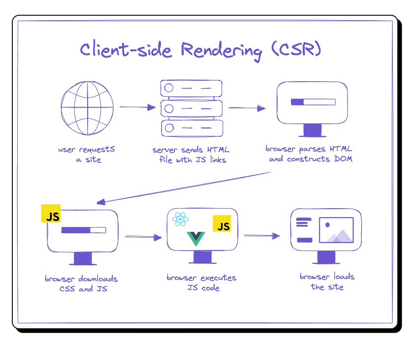
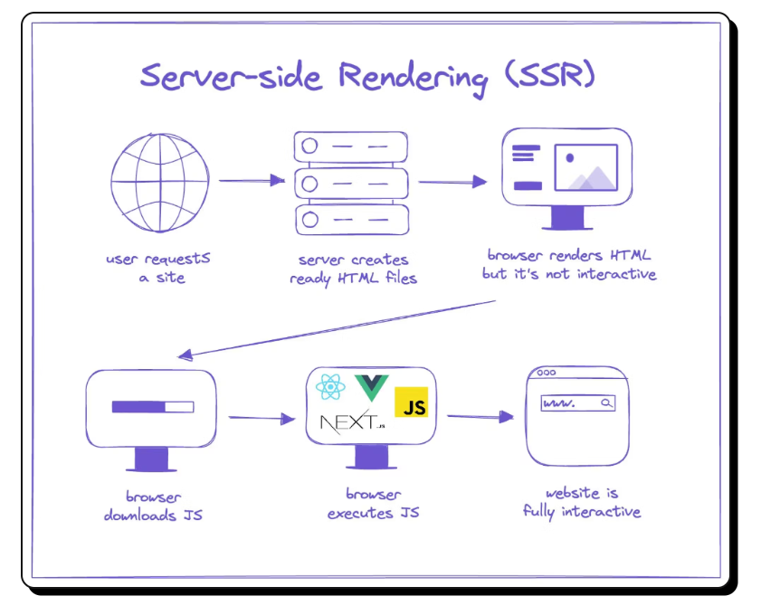

## ❤️ Learning Next.js 🚀

I'm diving into Next.js, and it's so exciting! 🎉 It's amazing how it simplifies React for full-stack development, especially with server-side rendering (SSR) and API routes. I'm just getting started, but I'm loving the performance benefits and the streamlined workflow! ⚡️

💬 What is Next.js?
 
Next.js is a React framework for building full-stack web applications. With Next.js, you use React components to build user interfaces, and it adds awesome features like:

- ⚡ Server-side Rendering (SSR) for better performance and SEO.
- 📦 Static Site Generation (SSG) for fast, pre-rendered pages.
- 🔄 API routes for easily building back-end functionality.
- 🛠 Automatic bundling & compiling to take care of configurations, so you can focus on coding!

💬 What is React.js?
 
React.js is an open-source JavaScript library for building user interfaces, particularly for single-page applications. It allows you to create reusable UI components and manage the state of your application efficiently.

🔥 Key Features of React:

- Component-based architecture: Build encapsulated components that manage their own state, then compose them to create complex UIs.
- Virtual DOM: React uses a virtual DOM to efficiently update and render only the necessary components, improving performance. ⚡
- Declarative syntax: Write clean, readable code by describing what the UI should look like, not how to get there.
- One-way data binding: Keeps everything predictable by managing data flow in a unidirectional manner.

💬 What is Client-Side-Rendering (CSR)?
 
Client-Side Rendering (CSR) is a web development technique where the browser renders the content using JavaScript on the client side (the user's browser) rather than receiving fully rendered HTML from the server.

In CSR:

- 🏁 Initial Load: The browser downloads a minimal HTML file along with JavaScript files.
- ⚙️ Rendering: JavaScript runs in the browser to dynamically build the content and render the user interface.
- 🚀 Interaction: Once the JavaScript is loaded, the app becomes highly interactive as it can fetch and display new data without reloading the entire page.

💻 CSR in React
In React.js, Client-Side Rendering is the default approach. Here's how it works:

- React Components are shipped as JavaScript files.
- The browser executes the JavaScript to render components on the screen.
- React leverages a Virtual DOM to efficiently update only the parts of the UI that have changed, making CSR faster than traditional full-page reloads.

🚀 Benefits of CSR:

- 🔄 Dynamic Updates: React components can update without a full page reload, making the app feel smooth and fast.
- 📡 API Calls: Great for fetching data from APIs after the initial page load.
- 🛠 Flexible UIs: Makes it easy to build highly interactive web applications.

🔍 Downsides of CSR:

- ⏳ Initial Load Time: The first load might be slower since the browser needs to download and execute JavaScript before rendering the UI.
- 🔍 SEO Challenges: Since the initial HTML is minimal, search engine crawlers might not index the content effectively.

 

💬 What is Server-Side-Rendering (SSR)?
 
Server-side rendering (SSR) is a technique for rendering web content on the server-side, i.e., before the page is sent to the client.
In server-side rendering, the server generates the HTML for a page, which is then sent to the client. This is in contrast to client-side rendering, where the HTML is generated on the client-side, using JavaScript to render content in the browser.
With SSR, the server receives a request from the client and generates the HTML for the requested page. The resulting HTML is then sent to the client, which can display it in the browser.

 
 
💬 Difference Between CSR and SSR ?
 