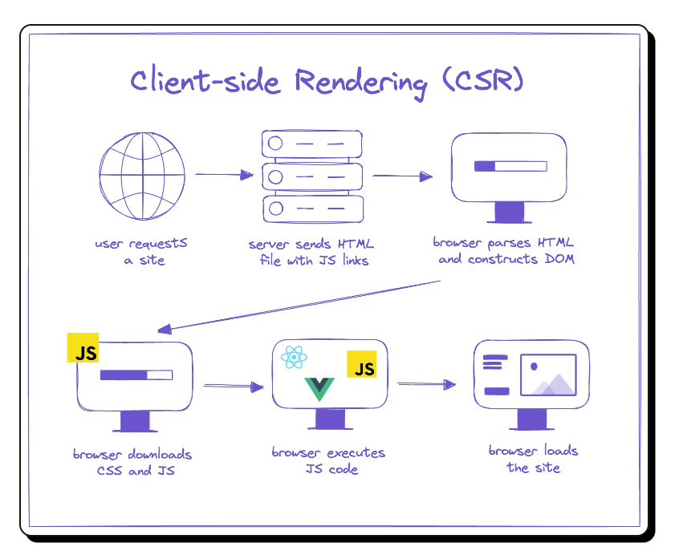
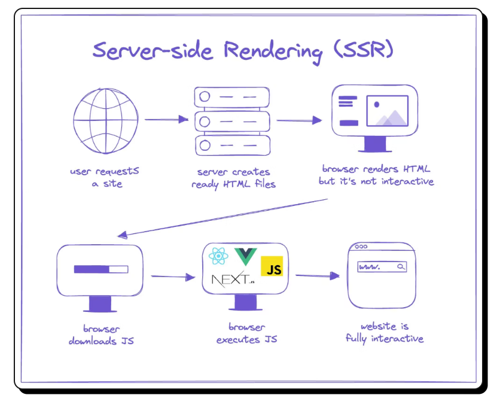

## ❤️ Learning Next.js 🚀

I'm diving into Next.js, and it's so exciting! 🎉 It's amazing how it simplifies React for full-stack development, especially with server-side rendering (SSR) and API routes. I'm just getting started, but I'm loving the performance benefits and the streamlined workflow! ⚡️

<hr/>
💬 What is Next.js?
<br>
Next.js is a React framework for building full-stack web applications. With Next.js, you use React components to build user interfaces, and it adds awesome features like:

- ⚡ Server-side Rendering (SSR) for better performance and SEO.
- 📦 Static Site Generation (SSG) for fast, pre-rendered pages.
- 🔄 API routes for easily building back-end functionality.
- 🛠 Automatic bundling & compiling to take care of configurations, so you can focus on coding!
<hr/>
💬 What is React.js?
<br>
React.js is an open-source JavaScript library for building user interfaces, particularly for single-page applications. It allows you to create reusable UI components and manage the state of your application efficiently.

🔥 Key Features of React:

- Component-based architecture: Build encapsulated components that manage their own state, then compose them to create complex UIs.
- Virtual DOM: React uses a virtual DOM to efficiently update and render only the necessary components, improving performance. ⚡
- Declarative syntax: Write clean, readable code by describing what the UI should look like, not how to get there.
- One-way data binding: Keeps everything predictable by managing data flow in a unidirectional manner.
<hr/>
💬 What is Client-Side-Rendering (CSR)?
<br>
Client-Side Rendering (CSR) is a web development technique where the browser renders the content using JavaScript on the client side (the user's browser) rather than receiving fully rendered HTML from the server.

In CSR:

- 🏁 Initial Load: The browser downloads a minimal HTML file along with JavaScript files.
- ⚙️ Rendering: JavaScript runs in the browser to dynamically build the content and render the user interface.
- 🚀 Interaction: Once the JavaScript is loaded, the app becomes highly interactive as it can fetch and display new data without reloading the entire page.

💻 CSR in React
In React.js, Client-Side Rendering is the default approach. Here's how it works:

- React Components are shipped as JavaScript files.
- The browser executes the JavaScript to render components on the screen.
- React leverages a Virtual DOM to efficiently update only the parts of the UI that have changed, making CSR faster than traditional full-page reloads.

🚀 Benefits of CSR:

- 🔄 Dynamic Updates: React components can update without a full page reload, making the app feel smooth and fast.
- 📡 API Calls: Great for fetching data from APIs after the initial page load.
- 🛠 Flexible UIs: Makes it easy to build highly interactive web applications.

🔍 Downsides of CSR:

- ⏳ Initial Load Time: The first load might be slower since the browser needs to download and execute JavaScript before rendering the UI.
- 🔍 SEO Challenges: Since the initial HTML is minimal, search engine crawlers might not index the content effectively.


<hr/>
💬 What is Server-Side-Rendering (SSR)?
<br>
Server-side rendering (SSR) is a technique for rendering web content on the server-side, i.e., before the page is sent to the client.
In server-side rendering, the server generates the HTML for a page, which is then sent to the client. This is in contrast to client-side rendering, where the HTML is generated on the client-side, using JavaScript to render content in the browser.
With SSR, the server receives a request from the client and generates the HTML for the requested page. The resulting HTML is then sent to the client, which can display it in the browser.
<br/>

<hr/> 
💬 Differences Between Client-Side and Server-Side Rendering (CSR vs. SSR) ?

- 🛠 Rendering Process

→ Client-Side Rendering (CSR): The rendering process occurs in the client's browser. The server only provides a minimal HTML file, and the browser executes JavaScript to render the page.
<br>
→ Server-Side Rendering (SSR): The rendering process occurs on the server, which sends the fully-rendered HTML file to the browser. This means the page is ready for display upon loading.

- 🌐 SEO

→ CSR: Search engines struggle to properly index pages rendered on the client because they often encounter a blank or minimal page on their initial crawl.
<br>
→ SSR: SSR sends fully-rendered HTML to the browser, which allows search engines to properly analyze, index, and rank the content. Better for SEO.

- ⏳ Initial Page Load Time

→ CSR: Slower initial page load, as the browser must download and execute JavaScript before rendering the UI.
<br>
→ SSR: Faster initial page load, as the fully-rendered HTML is served directly from the server, providing content immediately.

- ⚡️ Interactivity

→ CSR: Offers highly interactive and dynamic experiences because rendering happens directly in the browser. Users can interact with the page without reloading.
<br>
→ SSR: UI updates require a round-trip to the server, which can limit interactivity and make updates feel slower compared to CSR.

- 🖼 User Experience

→ CSR: Users may initially see an empty page or loading indicator before the JavaScript fetches and renders the UI.
<br>
→ SSR: Users immediately see a fully-rendered page on first load, providing a smoother and faster visual experience.

<hr>

### 🔥 Create the Next js App

You need to write the following commands on the terminal screen (in vscode) so that you can create and run this project locally.

```bash
    npx create-next-app@latest
```

You will then be asked the following prompts:

```bash
    What is your project named?  my-app
    Would you like to use TypeScript?  No / Yes
    Would you like to use ESLint?  No / Yes
    Would you like to use Tail  wind CSS?  No / Yes
    Would you like your code inside a `src/` directory?  No / Yes
    Would you like to use App Router? (recommended)  No / Yes
    Would you like to use Turbopack for `next dev`?  No / Yes
    Would you like to customize the import alias (`@/*` by default)?  No / Yes
```

Once you've answered the prompts, a new project will be created with your chosen configuration.

#### Initial Files and Directories

Once the installation is complete, you'll find that Next.js has generated a default directory structure for you. This initial file structure is designed to give you a head start with a functional app right out of the box. Here's what you can expect:

- pages directory: This folder is the heart of your Next.js app's routing system. Each .js file or .tsx file inside this directory automatically becomes a route based on its file name.

- public folder: This is where you'll place static assets like images, fonts, and any other files that need to be accessed publicly.

- styles folder: Contains the default CSS files for styling your app. You can add your own stylesheets here or modify the existing ones to tailor the look and feel of your app.

- .next folder: This is a generated folder that contains the output of the Next.js build process. You typically won't need to touch this folder directly.

- node_modules directory: Houses all the third-party libraries and dependencies for your app.

- package.json file: This json file keeps track of all the dependencies and scripts for your Next.js project. It's an essential part of your app's configuration.

- next.config.js file: Optional config file that allows you to customize various aspects of Next.js behavior.

- .gitignore file: A pre-configured file that tells Git which files or folders to ignore in your project.

- README.md file: A markdown file where you can provide information about your project, such as setup instructions and documentation.